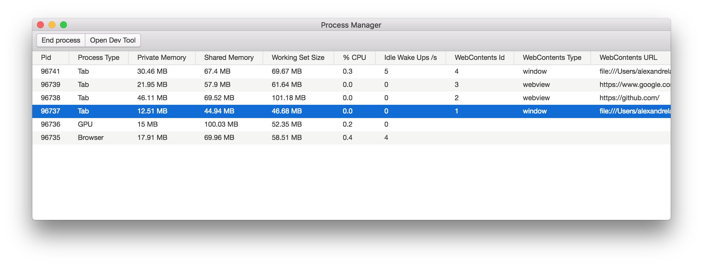

# Process Manager UI for Electron Apps

This package provides a process manager for Electron applications. It's inspired from Chrome's task manager.

:warning: For Electron >=1.7.0



## Features

- [x] Memory reporting
- [x] Link memory data to web-contents (for electron >=1.7.1)
- [x] Kill a process from the UI

## Installation

```bash
$ npm install electron-process-manager
```

## Usage
```
const { openProcessManager } = require('electron-process-manager');

openProcessManager();
```

## Future

- Add physical memory (noted as "Memory" in Chrome's task manager)
- Add CPU metrics (once [electron#9486](https://github.com/electron/electron/pull/9486)) is merged)
- Add networks metrics

Pull requests welcome :)

## License

MIT License
